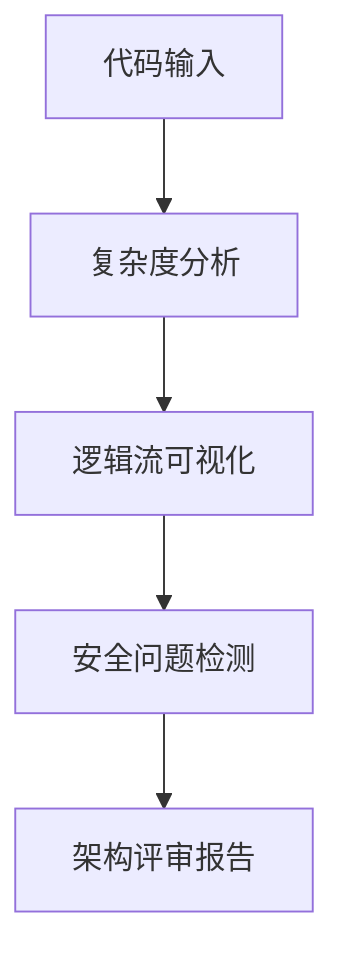
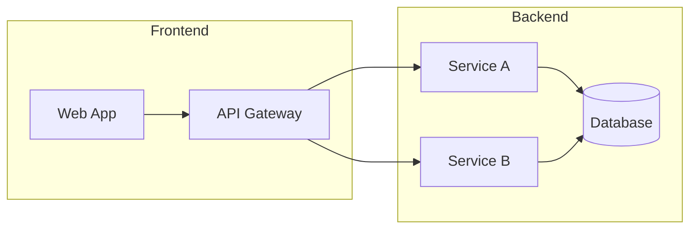
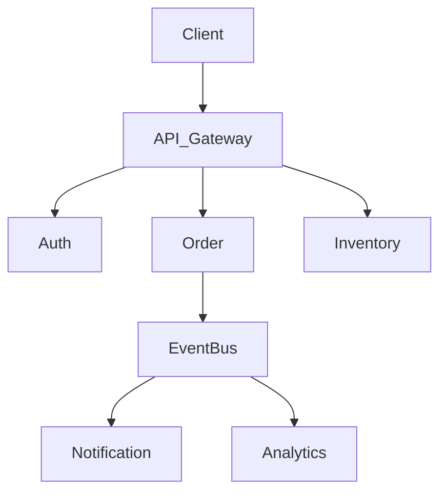
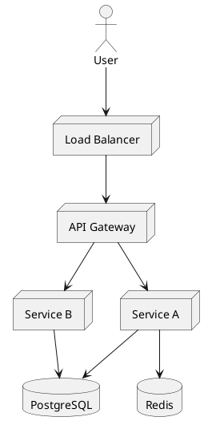

# 程序龙阶段二：架构能力升级行动计划

> 📅 制定时间：2026-03-29
> 🎯 目标：从代码级审查升级到架构级评审

---

## 一、架构评审能力建设

### 1.1 代码架构分析流程

**使用 quack-code-review 进行架构级分析**：

```bash
# 基础代码分析
node ~/.openclaw/workspace/skills/quack-code-review/scripts/analyze.mjs --file /path/to/code

# 架构分析要点：
# - 复杂度评分（Complexity Score）
# - 逻辑流可视化（Logic Flow）
# - 安全问题（Security Issues）
# - Bug 检测
```

**架构分析检查清单**：
| 检查项 | 工具/方法 | 产出 |
|:---|:---|:---|
| 代码复杂度 | quack-code-review | 复杂度评分 |
| 依赖关系 | 逻辑流分析 | 依赖图 |
| 安全风险 | 安全问题检测 | 风险清单 |
| 架构气味 | 人工 review | 改进建议 |

### 1.2 架构评审输出模板



---

## 二、技术选型框架

### 2.1 常见场景决策树

**数据库选型**：
```
场景判断
    │
    ├── 事务强一致 → PostgreSQL/MySQL
    ├── 高写入量 + 弱一致 → Cassandra/DynamoDB
    ├── 向量检索 → Pinecone/Milvus/pgvector
    ├── 图关系 → Neo4j
    └── 时序数据 → InfluxDB/TimescaleDB
```

**消息队列选型**：
```
场景判断
    │
    ├── 大规模吞吐 + 低延迟 → Kafka
    ├── 简单易用 + 低延迟 → Redis Streams
    ├── 消息顺序重要 → RabbitMQ
    └── 云原生无服务 → AWS SQS
```

**前端框架选型**：
```
场景判断
    │
    ├── 简单页面 → Vue/React CDN
    ├── 中后台 → React/Vue + AntD
    ├── 低代码平台 → Vue 3 + Element Plus
    └── 高性能SPA → React + 自行封装
```

### 2.2 技术选型评分卡

| 评估维度 | 权重 | 说明 |
|:---|:---|:---|
| 功能匹配度 | 30% | 满足核心需求程度 |
| 学习成本 | 20% | 团队上手难度 |
| 生态成熟度 | 20% | 社区活跃度、插件丰富度 |
| 运维复杂度 | 15% | 部署、监控、备份 |
| 成本 | 15% | 许可费用 + 运维成本 |

---

## 三、架构图生成

### 3.1 Mermaid 常用架构图模板

**系统架构图**：


**微服务架构**：


### 3.2 PlantUML 部署图



---

## 四、cto-advisor 深度应用

### 4.1 技术债务分析

```bash
# 运行技术债务分析器
python ~/.openclaw/workspace/skills/cto-advisor/scripts/tech_debt_analyzer.py --output tech-debt-report.json
```

**输出格式**：
```
Item                  | Severity | Cost-to-Fix | Blast Radius | Priority Score
----------------------|----------|-------------|--------------|---------------
Auth service (v1 API) | P1       | 8 days      | 6 services   | HIGH
```

### 4.2 团队规模计算

```bash
# 运行团队规模计算器
python ~/.openclaw/workspace/skills/cto-advisor/scripts/team_scaling_calculator.py --team-size 20 --growth-rate 1.5
```

### 4.3 ADR 架构决策记录

**ADR 模板**：
```
# ADR-XXX: [决策标题]

## 状态
[Proposed | Accepted | Superseded]

## 背景
[描述问题和约束]

## 考虑选项
- Option A: [描述] - TCO: $X | Risk: Low/Med/High
- Option B: [描述] - TCO: $X | Risk: Low/Med/High

## 决策
[选中的选项和理由]

## 后果
- ✅ [变得容易的事]
- ❌ [变得困难的事]
```

---

## 五、阶段二执行清单

### 5.1 技能掌握

- [ ] 熟练使用 quack-code-review 分析代码架构
- [ ] 掌握 Mermaid/PlantUML 架构图绘制
- [ ] 运行 cto-advisor tech_debt_analyzer.py
- [ ] 运行 cto-advisor team_scaling_calculator.py
- [ ] 建立 ADR 模板库

### 5.2 产出物

- [ ] 3个常见场景的技术选型决策树
- [ ] 5个常用架构图模板（Mermaid）
- [ ] 1份技术债务分析报告示例
- [ ] 1份 ADR 示例
- [ ] DORA 指标监控仪表盘设计

---

## 六、验证标准

程序龙阶段二完成标志：
1. 能独立完成代码架构分析并输出报告
2. 能根据场景给出技术选型建议并附带决策树
3. 能用 Mermaid 生成标准架构图
4. 能运行 cto-advisor 工具并解读输出
5. 能编写标准 ADR 文档

---

*🐉 程序龙 - 架构能力的守护者*
*v2.2: 阶段二行动计划已制定*
